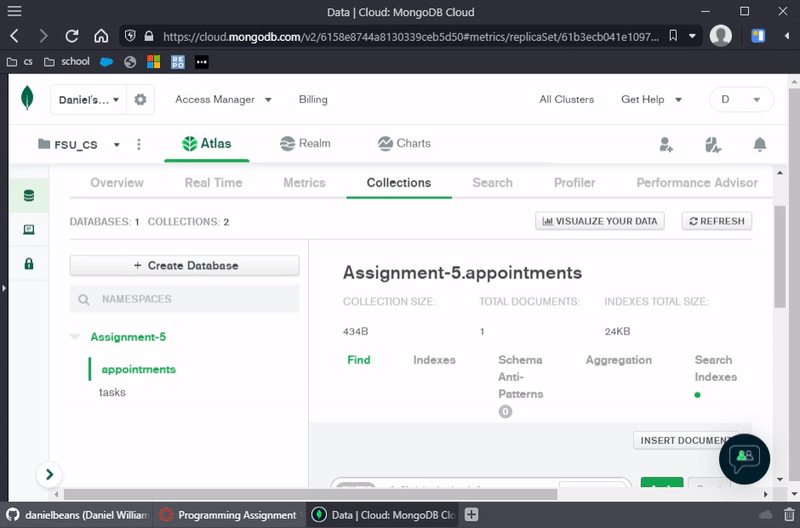

# Task Manager

## Versions

[v1](#Version-1) &nbsp; [v2](#Version-2) &nbsp; [v3](#Version-3) &nbsp; [v4](#Version-4) &nbsp; [v5](#Version-5)

## Overview

Task Manager is a task management application developed in **C#** using the **.Net Framework** for the course _CIS 4930 - .NET Development With C#_ at Florida State University over the Fall 2021 semester.

Task Manager aims to allows users to create, delete, update, and view tasks and appointment in a Windows desktop application environment.

### Technologies

- C# and .NET
- UWP (Universal Windows Platform)
- Visual Studio
- MongoDB and MongoDB Atlas

## Version 1

 

### Requirements

- Console app
- CRUD for class Task

## Version 2

 

### Requirements

- Paging when view tasks
- CRUD for an additional class Appointment derived from new base class Item
- Search functionality
- Save and load using serialization/deserialization

## Version 3

 

### Requirements

- UI driven application using UWP
- Save and load tasks and appointments using AppData cache
- New Item class property _Priority_
- Sort task/appointment list by priority functionality

## Version 4

 

### Requirements

- Implement WebAPI server with CRUD functionality for tasks and appointments
- Connect client to API

## Version 5

 

### Requirements

- Implement CRUD in API with a persistent database such as SQL, MongoDB, Firebase, etc.
